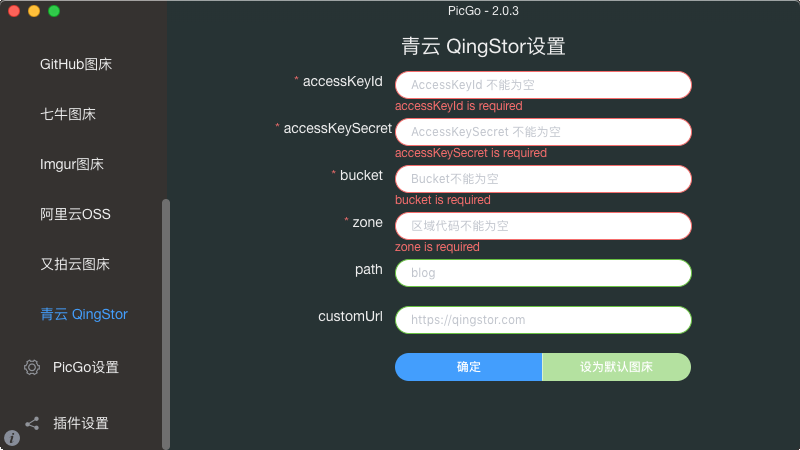

## picgo-plugin-qingstor-uploader

[English](./README.md) | 简体中文

为 [PicGo](https://github.com/Molunerfinn/PicGo) 开发的一款插件，新增了[青云 QingStor](https://www.qingcloud.com/products/qingstor/) 图床。

### 安装

- 在线安装

    打开 [PicGo](https://github.com/Molunerfinn/PicGo) 详细窗口，选择**插件设置**，搜索**qingstor-uploader**安装，然后重启应用即可。

- 离线安装

    克隆该项目，复制项目到 以下目录：
    - Windows: `%APPDATA%\picgo\`
    - Linux: `$XDG_CONFIG_HOME/picgo/` or `~/.config/picgo/`
    - macOS: `~/Library/Application\ Support/picgo/`

    切换到新目录执行 `npm install ./picgo-plugin-qingstor-uploader`，然后重启应用即可。

### 截图

### 配置

|参数名称|类型|描述|是否必须|
|:--:|:--:|:--:|:--:|
|accessKeyId|input|AccessKeyId|true|
|accessKeySecret|password|AccessKeySecret|true|
|bucket|input|Bucket 名称|true|
|zone|input|区域 zone|true|
|path|input|上传时默认存储路径|false|
|customUrl|input|私有云网址（示例：https://qingstor.com ）|false|

