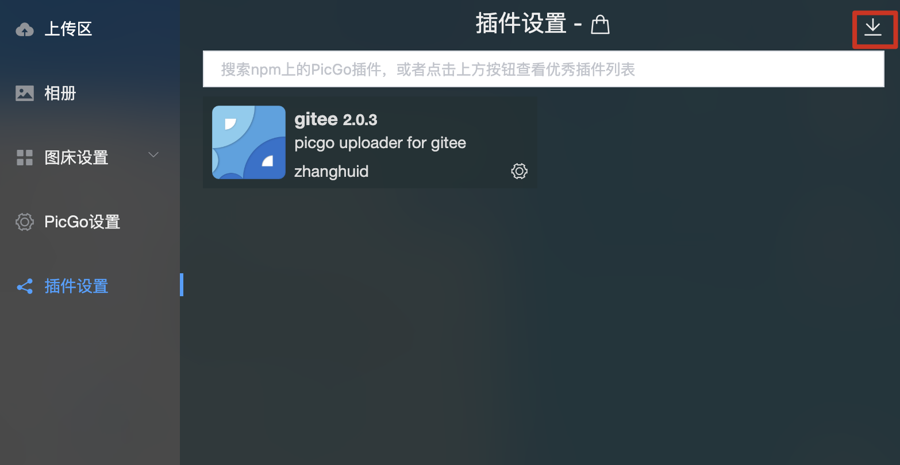

## picgo-plugin-qingstor-uploader

English | [简体中文](./README-zh_CN.md)

A plugin for [PicGo](https://github.com/Molunerfinn/PicGo) with the addition of the [QingStor](https://www.qingcloud.com/products/qingstor/) image hosting.

### Installation

- Online Installation

  1. Open the details window of [PicGo](https://github.com/Molunerfinn/PicGo), select **Plugin Settings**, and search **qingstor-uploader** for installation.
  2. Then restart the application.

- Offline Installation

  1. Clone the repository
  2. Open the details window of [PicGo](https://github.com/Molunerfinn/PicGo), select **Plugin Settings**, and click the icon below.
  
  3. Select the folder you cloned the repository to.
  4. Restart the application.

### Screenshots

### Configuration

|Parameter Name|Type|Description|Required|
|:--:|:--:|:--:|:--:|
|accessKeyId|input|AccessKeyId|true|
|accessKeySecret|password|AccessKeySecret|true|
|bucket|input|Bucket Name|true|
|zone|input|Zone|true|
|path|input|Default storage path when upload|false|
|customUrl|input|Private cloud website(eg: https://qingstor.com )|false|

